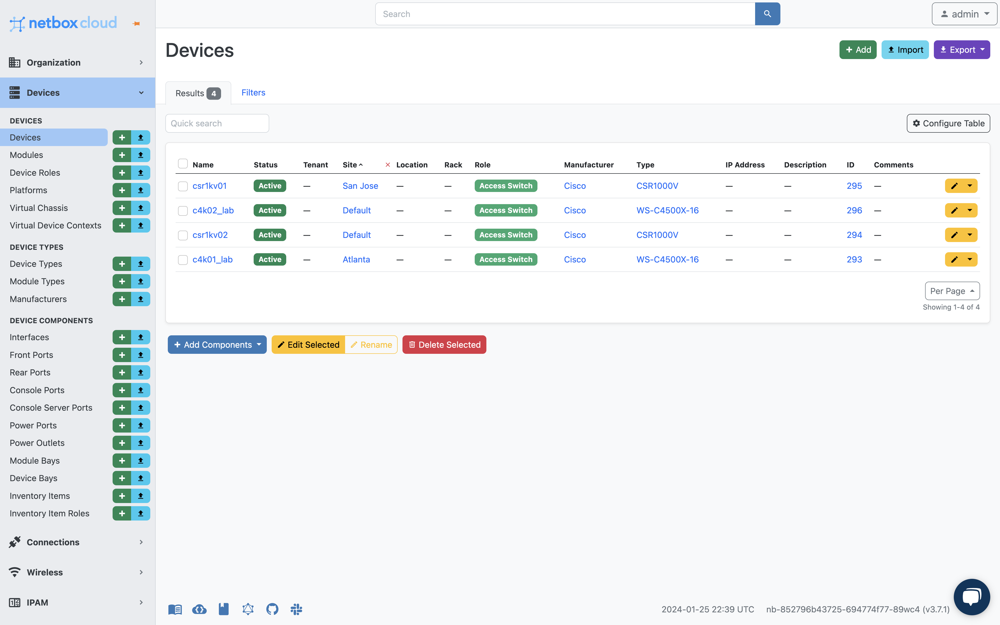
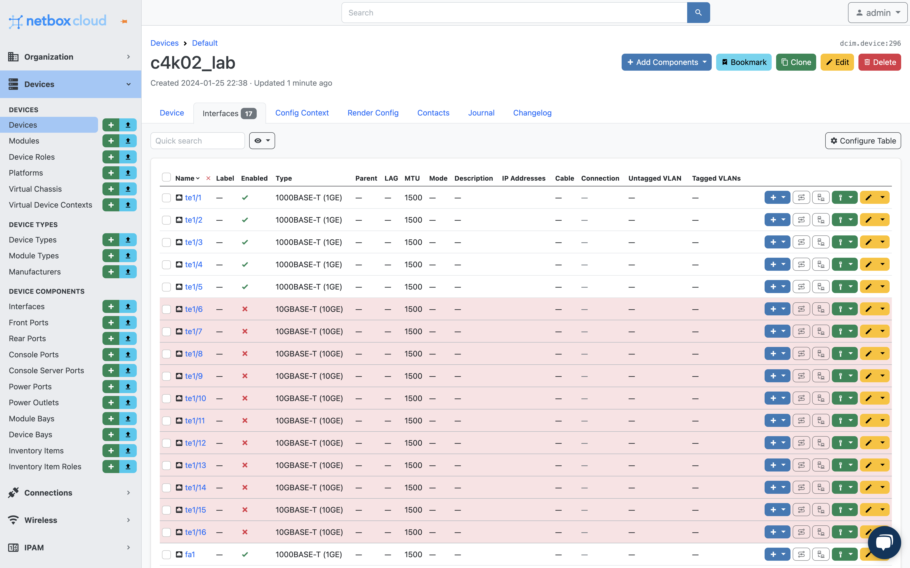
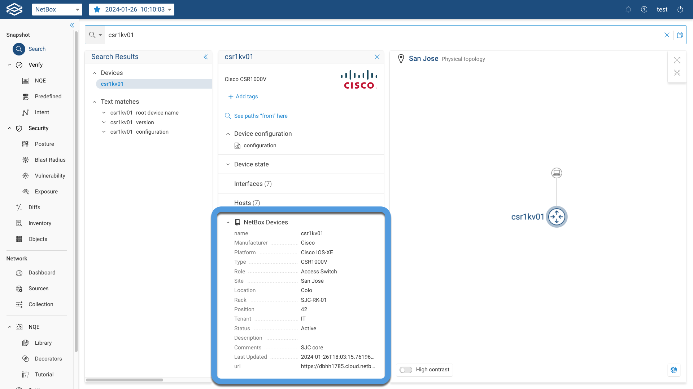
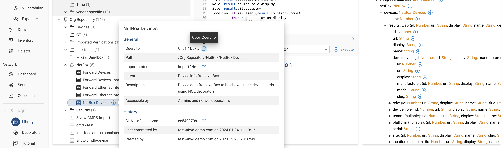

# Forward Enterprise and NetBox

## Forward Enterprise
Forward Networks’ flagship product, [Forward Enterprise](https://www.forwardnetworks.com/forward-enterprise/),
provides a vendor-agnostic *network digital twin* of the network.

This software platform generates a virtual replica, commonly known as a digital twin, encompassing your entire network,
including all its devices, connections, and configurations, both on-premises and in the cloud.

The platform enables you to:

* **Proactively identify and resolve issues:** By continuously analyzing the digital twin, Forward Enterprise can
    pinpoint configuration errors, security vulnerabilities, and potential problems before they cause outages or
    breaches.
* **Gain deeper network visibility:**: The digital twin provides a holistic view of your network, spanning from
    on-premises data centers to multi-cloud environments.
    This allows you to understand how everything is interconnected and how changes in one area might impact another.
* **Simplify network operations:** Forward Enterprise automates many manual tasks, such as change verification and
  troubleshooting, making it easier and faster for your IT team to manage the network.
* **Enhance security posture:** The platform helps you to identify and prioritize security vulnerabilities, track attack 
  surfaces, and validate the effectiveness of your security controls.

## NetBox

**NetBox** is a **network documentation and Infrastructure Resource Modeling (IRM)** tool designed specifically for
network engineers and operators.
It combines the functionalities of **IP Address Management (IPAM)** and **Data Center Infrastructure Management
(DCIM)** into a single platform, providing a centralized **source of truth** for your network.


Here are some key things to know about NetBox:

NetBox allows you to:

* **IP address management**: Track and manage available IP addresses, subnets, and VLANs.
* **DCIM**: Document your network infrastructure, including racks, devices, cables, power distribution, and virtual 
  machines.

## Better Together

The integration between Forward Enterprise and NetBox enables you to:
* Onbaord your NetBox instance by importing data discovered and collected by Forward Enterprise from your network
  utilizing a provided Python script.
  In this initial integration, you can export Forward devices and interfaces into your NetBox DCIM.
* Import device data such as role, tenant, and racks, not collected by Forward, from NetBox and display it in
  Forward Enterprise.

# Export data from Forward Enterprise into NetBox

## Prerequisites

1. **Create NQE queries in Forward Enterprise**: the Python script retrieves the data to be exported from Forward
   Enterprise via NQE Queries IDs. Refer to the [NQE Queries](#nqe-queries) section for more details.
2. **Configure necessary data in Netbox**: in this intial release, we assume all mandatory data required for adding
   devices and interfaces is already configured in NetBox. This include, **Sites**, **Device Types**, and **Device
   Roles**.
3. A host with Python version 3.10 or later.

## Try it out

1. Clone the GitHub repository below on a machine with Python version 3.10 and navigate to the main directory of the
   repository
   
```
$ git clone https://github.com/forwardnetworks/fwd-netbox
$ cd fwd-netbox
```
2. Set up a local properties file using the provided sample
```
$ cp fwd-ansible.properties.sample fwd-ansible.properties
```
3. Fill in the content to match your Forward and NetBox instances
> Note: Forward Entrprise does not have the concept of Device Role.
> You need to create a Device Role and add its ID the NetBox `device` section

```
---
forward:
  host: <fwd Enterprise URL>
  authentication: Basic <basic auth b64enc here>
  network_id: <Network id>
  nqe:
    devices_query_id: <NQE Query ID>
    interfaces_query_id: <NQE Query ID>

netbox:
  host: <NetBox instance URL>
  authentication: Token <auth token here>
  device:
    role: <Role ID>
```
4. Run the `export_to_netbox.py` script.
```
$ python3 export_to_netbox.py
```
5. Verify in NetBox
   Log in to your NetBox instance and verify if the devices and interfaces are sucesfully imported.
   In the screenshot below, you can find an example of importing 4 devices and their interfaces:
   
   

   If you encounter any issues, set the `debug_flag` to `True` in the Python script and run it again.

The process can be fully automated by creating a webhook in Forward Enterprise so that the export will run
every time Forward Enterprise collects data from the network, ensuring an always accurate inventory in NetBox.

# Import data from NetBox to Forward Enterprise

## Prerequisites

1. **Create NQE query in Forward Enterprise**: the Python script retrieves the data to be exported 
   from Forward Enterprise via NQE Queries IDs. Refer to the [NQE Queries](#nqe-queries) section for details.
2. **Create a NetBox Device Decorator**: Create a NetBox Device Decorator in Forward Enterprise using the NQE query
    mentioned above


## Try it out

Search for any device and verify the presence of the NetBox Devices decorator in the device card, as in the example 
below:



# NQE Queries

Below are the NQE Query to be configured in Forward Enterprise.
Both **Forward Devices** and **Forward Interfaces** queries are required for exporting data from Forward Entrprise
into NetBox, while the **NetBox Devices** query is needed for importing data from NetBox to Forward Enterprise.

Take note of the NQE query IDs; you will need them later. Refer to the [Try it out](#try-it-out) for details.
You can find the IDs by clicking on the **Info** icon


> **Note:** Soon this step will not be required anymore.
> The NQE queries will be published in the Forward NQE Library and the query IDs added to the
> configuration.yaml.example file.

## Forward Devices

```
/**
 * @intent Ethernet Interfaces collected by Forward
 * @description Ethernet Interfaces collected by Forward to be exported to NetBox
 */
foreach device in network.devices
where device.platform.vendor != Vendor.FORWARD_CUSTOM // Exclude Forward Custom Device

foreach interface in device.interfaces
where interface.interfaceType == IfaceType.IF_ETHERNET // Select Ethernet interface only

let deviceName = device.name
let speed = interface.ethernet.negotiatedPortSpeed
let test = interface.interfaceType
let status = interface.operStatus
let duplexMode = interface.ethernet.negotiatedDuplexMode
select {
  device: deviceName,
  name: interface.name,
  type: speed,
  enabled: if status == OperStatus.UP then "1" else "0",
  mtu: interface.mtu,
  mac_address: interface.ethernet.macAddress,
  speed: speed,
  duplex: if duplexMode == DuplexMode.FULL
          then "full"
          else "half",
  comment: "Interface Added by Forward Enterprise"
}
```

## Forward Interfaces
```
/**
 * @intent Ethernet Interfaces collected by Forward
 * @description Ethernet Interfaces collected by Forward to be exported to NetBox
 */
foreach device in network.devices
where device.platform.vendor != Vendor.FORWARD_CUSTOM // Exclude Forward Custom Device

foreach interface in device.interfaces
where interface.interfaceType == IfaceType.IF_ETHERNET // Select Ethernet interface only

let deviceName = device.name
let speed = interface.ethernet.negotiatedPortSpeed
let test = interface.interfaceType
let status = interface.operStatus
let duplexMode = interface.ethernet.negotiatedDuplexMode
select {
  device: deviceName,
  name: interface.name,
  type: speed,
  enabled: if status == OperStatus.UP then "1" else "0",
  mtu: interface.mtu,
  mac_address: interface.ethernet.macAddress,
  speed: speed,
  duplex: if duplexMode == DuplexMode.FULL
          then "full"
          else "half",
  comment: "Interface Added by Forward Enterprise"
}
```
## NetBox Devices
```
/**
 * @intent Device info from NetBox
 * @description Device data from NetBox to be shown in the device cards using NQE decorators
 */

foreach externalSources in [network.externalSources]
let netBox_cloud = externalSources.netBox
let devices = netBox_cloud.devices
foreach result in devices.results
select {
  name: result.name,
  Manufacturer: result.device_type.manufacturer.display,
  Platform: if isPresent(result.platform?.display)
            then result.platform?.display
            else "N/A",
  Type: result.device_type.display,
  Role: result.device_role.display,
  Site: result.site.display,
  Location: if isPresent(result.location?.name)
            then result.location.display
            else "N/A",
  Rack: result.rack?.display,
  Position: result.position,
  Tenant: result.tenant?.display,
  Status: result.status.label,
  Description: result.description,
  Comments: result.comments,
  "Last Updated": result.last_updated,
  url: result.url
}
```

# Provide Feedback and Contributions

If you're interested in contributing to this integration or have any feedback, please let us know at
https://community.forwardnetworks.com/ or feel free to fork the repository and create a pull request (PR) with your
changes.

Main contributors:
- Manuel Corona, Forward Networks ([GitHub](https://github.com/Gusymochis),
  [LinkedIn](https://www.linkedin.com/in/mcorona-ayala/), [Twitter](https://twitter.com/coldalchemy))
- Fabrizio Maccioni, Forward Networks  ([GitHub](https://github.com/maccioni),
  [LinkedIn](https://www.linkedin.com/in/fabrizio-maccioni/), [Twitter](https://twitter.com/fabrimaccioni))
