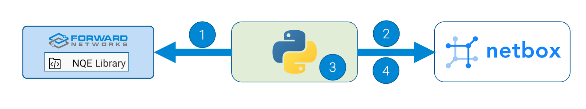
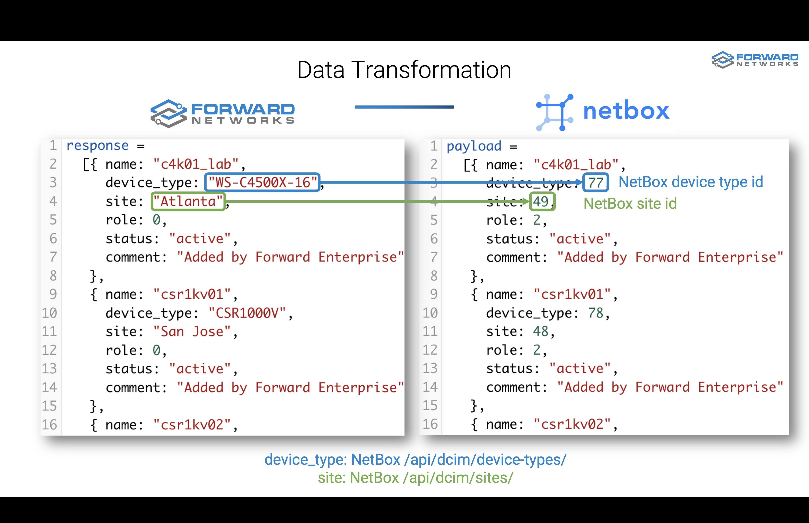

# Forward Enterprise and NetBox

## Forward Enterprise
Forward Networks’ flagship product, [Forward Enterprise](https://www.forwardnetworks.com/forward-enterprise/),
provides a vendor-agnostic *network digital twin* of the network.

This software platform generates a virtual replica, commonly known as a digital twin, encompassing your entire network,
including all its devices, connections, and configurations, both on-premises and in the cloud.

The platform enables you to:

* **Proactively identify and resolve issues:** By continuously analyzing the digital twin, Forward Enterprise can
    pinpoint configuration errors, security vulnerabilities, and potential problems before they cause outages or
    breaches.
* **Gain deeper network visibility:**: The digital twin provides a holistic view of your network, spanning from
    on-premises data centers to multi-cloud environments.
    This allows you to understand how everything is interconnected and how changes in one area might impact another.
* **Simplify network operations:** Forward Enterprise automates many manual tasks, such as change verification and
  troubleshooting, making it easier and faster for your IT team to manage the network.
* **Enhance security posture:** The platform helps you to identify and prioritize security vulnerabilities, track attack
  surfaces, and validate the effectiveness of your security controls.

## NetBox

**NetBox** is a **network documentation and Infrastructure Resource Modeling (IRM)** tool designed specifically for
network engineers and operators.
It combines the functionalities of **IP Address Management (IPAM)** and **Data Center Infrastructure Management
(DCIM)** into a single platform, providing a centralized **source of truth** for your network.


Here are some key things to know about NetBox:

NetBox allows you to:

* **IP address management**: Track and manage available IP addresses, subnets, and VLANs.
* **DCIM**: Document your network infrastructure, including racks, devices, cables, power distribution, and virtual
  machines.

## Better Together

The integration between Forward Enterprise and NetBox enables you to:
* Onboard your NetBox instance by importing data discovered and collected by Forward Enterprise from your network
  utilizing a provided Python script.
  In this initial integration, you can export Forward devices and interfaces into your NetBox DCIM.
* Import device data such as role, tenant, and racks, not collected by Forward, from NetBox and display it in
  Forward Enterprise.

# Onboard a NetBox instance with Forward Data

Data collected from the network by the Forward platform can be exported into NetBox using the Python script provided
in this repository.

The script performs the following actions:



1. Retrieves Forward Devices and Interfaces using Forward NQE REST APIs
2. Gathers information such as Sites, Device Types, Device Roles, Interface types, etc. from NetBox via REST APIs
3. Translates the data from Forward into the NetBox schema
4. Pushes Devices and Interfaces to NetBox via NetBox REST APIs

## Prerequisites

1. **NQE queries in Forward Enterprise**: the Python script retrieves the data to be exported from Forward
   Enterprise via NQE Queries. Refer to the [NQE Queries](#nqe-queries) section for more details.
2. **Configure necessary data in NetBox**: in this initial release, we assume all mandatory data required for adding
   devices and interfaces is already configured in NetBox. This includes, **Sites**, **Device Types**, and **Device
   Roles**.
3. A host with Python version 3.10 or later.

## Try it out

1. **Clone the GitHub repository**

   Clone the repository on a machine with Python version 3.10 and navigate to the repository root directory

```
$ git clone https://github.com/forwardnetworks/fwd-netbox
$ cd fwd-netbox
```
2. **Set up a local properties file**

   Use the provided sample to create a local `configuration.yaml` property file
```
$ cp configuration.yaml.example configuration.yaml
```
3. **Fill in the content**

   Fill in the content to match your Forward and NetBox instances
> Note: Forward Entrprise does not have the concept of Device Role.
> You need to create a Device Role and add its ID in the NetBox `device` section

```yaml
---
# If set to True, the Python script asks for a confirmation to proceed with the devices and interfaces update in NetBox
# If set to False, the script updates devices and interfaces in NetBox without asking for a confirmation
interactive: False

forward:
  host: <fwd Enterprise URL>                      # For SaaS deployment set it to https://fwd.app
  authentication: Basic <basic auth b64enc here>  # For details, refer to https://fwd.app/api-doc#authentication
  network_id: <Network id>                        # You can find the network_id in the Forward UI URL
                                                  # (e.g. https://fwd.app/?/search?networkId=170256)
  nqe:
    # Do not change the NQE query IDs below unless you want to use your own NQE Queries and Python script
    devices_query_id: FQ_837817437f52a25bcfb88fe2b789040af9d44daa
    interfaces_query_id: FQ_97bcba26a420b4ed948bbd5d9c628e17150979e7

netbox:
  host: <NetBox instance URL>
  # For details about NetBox API Tokens, refer to https://demo.netbox.dev/static/docs/rest-api/authentication/#tokens
  authentication: Token <auth token here>
  device:
    # NQE does not have the concept of Device Role. You need to create a Device Role in NetBox and add its ID here
    role: <Role ID>
```
4. **Run the script**

   Run the `export_to_netbox.py` Python script
```
$ python3 export_to_netbox.py
```

If you have set the `interactive` flag to `True` in the `configuration.yaml` file, the script will display the
devices that would be created, those that would be updated, and ask for a confirmation to proceed.

```shell
The following  2  devices will be created
c4k01_lab
c4k02_lab
The following  2  devices will be updated
csr1kv02
csr1kv01
Do you want to proceed? (yes/no)
```

5. **Verify in NetBox**

   Log in to your NetBox instance and verify if the devices and interfaces are successfully imported.

   In the screenshot below, you can find an example of importing 4 devices and their interfaces:
   
   

   If you encounter any issues, set the `debug_flag` to `True` in the Python script and run it again.

The process can be fully automated by creating a webhook in Forward Enterprise so that the export will run
every time Forward Enterprise collects data from the network, ensuring an always accurate inventory in NetBox.

## How to customize the integration

If you want to customize the integration with new fields or to automatically create sites, device types, etc.
you need to:
1. Create and commit new NQE devices and/or interface queries. Take note of the NQE query IDs.
   You can find the IDs by clicking on the **Info** icon
   
2. Update the NQE queries ID[s] in the `configuration.yaml` file
3. Update the Python scripts based on your new logic

The NQE queries published in the Forward Library provide an API response with the same JSON structure as the payload in
the NetBox API, which is used to create or update devices and interfaces.

The Python script takes care of the data transformation logic.

For instance, the figure below shows how the script transforms the Forward device type string `WS-4500X-16` into a
NetBox `77` ID.
It also shows which NetBox APIs are used to map the data between Forward and NetBox.



The transformation logics are implemented in the `add_device_list` and the `add_interface_list` functions in the
`netbox_interface.py` file.

# Import data from NetBox to Forward Enterprise

## Prerequisites

1. **NQE query in Forward Enterprise**: Refer to the [NQE Queries](#nqe-queries) section for details.
2. **Create a NetBox Device Decorator**: Create a NetBox Device Decorator in Forward Enterprise using the NQE query
    mentioned above

## Try it out

Search for any device and verify the presence of the NetBox Devices decorator in the device card, as in the example
below:


# NQE Queries

Starting with Forward Enterprise version 24.2, all the NQE queries needed for the NetBox integration are published in
the Forward Library under the `/Forward Library/External/NetBox/Forward Devices` folder.

The NQE Queries are reported below for your reference.

Both **Forward Devices** and **Forward Interfaces** queries are used for exporting data from Forward Enterprise
into NetBox, while the **NetBox Devices** query is used for importing data from NetBox to Forward Enterprise.

The IDs of the NQE queries published in the Forward Library are already reported in the `configuration.yaml.example`
file.

If you would like to customize the integration using a different NQE query, you will need to create the new NQE
queries, commit them in Forward Enterprise, take note of the NQE query IDs, and update the IDs in the `configuration.
yaml` file.
Refer to the [How to customize the integration](#how-to-customize-the-integration) section for details.

## Forward Devices

```
/**
 * @intent Ethernet Interfaces collected by Forward
 * @description Ethernet Interfaces collected by Forward to be exported to NetBox
 */
foreach device in network.devices
where device.platform.vendor != Vendor.FORWARD_CUSTOM // Exclude Forward Custom Device

foreach interface in device.interfaces
where interface.interfaceType == IfaceType.IF_ETHERNET // Select Ethernet interface only

let deviceName = device.name
let speed = interface.ethernet.negotiatedPortSpeed
let test = interface.interfaceType
let status = interface.operStatus
let duplexMode = interface.ethernet.negotiatedDuplexMode
select {
  device: deviceName,
  name: interface.name,
  type: speed,
  enabled: if status == OperStatus.UP then "1" else "0",
  mtu: interface.mtu,
  mac_address: interface.ethernet.macAddress,
  speed: speed,
  duplex: if duplexMode == DuplexMode.FULL
          then "full"
          else "half",
  comment: "Interface Added by Forward Enterprise"
}
```

## Forward Interfaces
```
/**
 * @intent Ethernet Interfaces collected by Forward
 * @description Ethernet Interfaces collected by Forward to be exported to NetBox
 */
foreach device in network.devices
where device.platform.vendor != Vendor.FORWARD_CUSTOM // Exclude Forward Custom Device

foreach interface in device.interfaces
where interface.interfaceType == IfaceType.IF_ETHERNET // Select Ethernet interface only

let deviceName = device.name
let speed = interface.ethernet.negotiatedPortSpeed
let test = interface.interfaceType
let status = interface.operStatus
let duplexMode = interface.ethernet.negotiatedDuplexMode
select {
  device: deviceName,
  name: interface.name,
  type: speed,
  enabled: if status == OperStatus.UP then "1" else "0",
  mtu: interface.mtu,
  mac_address: interface.ethernet.macAddress,
  speed: speed,
  duplex: if duplexMode == DuplexMode.FULL
          then "full"
          else "half",
  comment: "Interface Added by Forward Enterprise"
}
```
## NetBox Devices
```
/**
 * @intent Device info from NetBox
 * @description Device data from NetBox to be shown in the device cards using NQE decorators
 */

foreach externalSources in [network.externalSources]
let netBox_cloud = externalSources.netBox
let devices = netBox_cloud.devices
foreach result in devices.results
select {
  name: result.name,
  Manufacturer: result.device_type.manufacturer.display,
  Platform: if isPresent(result.platform?.display)
            then result.platform?.display
            else "N/A",
  Type: result.device_type.display,
  Role: result.device_role.display,
  Site: result.site.display,
  Location: if isPresent(result.location?.name)
            then result.location.display
            else "N/A",
  Rack: result.rack?.display,
  Position: result.position,
  Tenant: result.tenant?.display,
  Status: result.status.label,
  Description: result.description,
  Comments: result.comments,
  "Last Updated": result.last_updated,
  url: result.url
}
```

# Provide Feedback and Contributions

If you're interested in contributing to this integration or have any feedback, please let us know at
https://community.forwardnetworks.com/ or feel free to fork the repository and create a pull request (PR) with your
changes.

Main contributors:
- Manuel Corona, Forward Networks ([GitHub](https://github.com/Gusymochis),
  [LinkedIn](https://www.linkedin.com/in/mcorona-ayala/), [Twitter](https://twitter.com/coldalchemy))
- Fabrizio Maccioni, Forward Networks  ([GitHub](https://github.com/maccioni),
  [LinkedIn](https://www.linkedin.com/in/fabrizio-maccioni/), [Twitter](https://twitter.com/fabrimaccioni))
