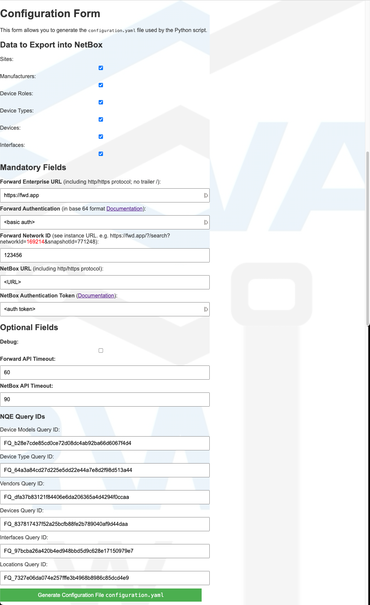

# Forward Enterprise and NetBox

## Forward Enterprise
Forward Networks’ flagship product, [Forward Enterprise](https://www.forwardnetworks.com/forward-enterprise/),
provides a vendor-agnostic *network digital twin* of the network.

This software platform generates a virtual replica, commonly known as a digital twin, encompassing your entire network,
including all its devices, connections, and configurations, both on-premises and in the cloud.

The platform enables you to:

- **Proactively identify and resolve issues:**
  By continuously analyzing the digital twin, Forward Enterprise can pinpoint configuration errors, security
  vulnerabilities, and potential problems before they cause outages or breaches.

- **Gain deeper network visibility:**
  The digital twin provides a holistic view of your network, spanning from on-premises data centers to multi-cloud
  environments.
  This allows you to understand how everything is interconnected and how changes in one area might impact another.

- **Simplify network operations:**
  Forward Enterprise automates many manual tasks, such as change verification and troubleshooting, making it easier
  and faster for your IT team to manage the network.

- **Enhance security posture:**
  The platform helps you to identify and prioritize security vulnerabilities, track attack surfaces, and validate the
  effectiveness of your security controls.

## NetBox

**NetBox** is a **network documentation and Infrastructure Resource Modeling (IRM)** tool designed specifically for
network engineers and operators.
It combines the functionalities of **IP Address Management (IPAM)** and **Data Center Infrastructure Management
(DCIM)** into a single platform, providing a centralized **source of truth** for your network.

Here are some key things to know about NetBox:

NetBox allows you to:

- **IP address management:**
  Track and manage available IP addresses, subnets, and VLANs.

- **DCIM:**
  Document your network infrastructure, including racks, devices, cables, power distribution, and virtual machines.

## Better Together

The integration between Forward Enterprise and NetBox enables you to:
- **Onboard your NetBox instance**
  Import data discovered and collected by Forward Enterprise from your network utilizing a provided Python script.
  You can start from an empty NetBox instance and export Forward Locations, Vendors, Device Types, Models, Devices, and
  Interfaces into your NetBox DCIM.

- **Import additional device data**
  Device attributes such as Roles, Tenants, and Racks (not collected by Forward) can be imported from NetBox and
  displayed in Forward Enterprise.

---

# Onboard a NetBox instance with Forward Data

Data collected from the network by the Forward platform can be exported into NetBox using the Python script provided
in this repository and Forward NQE queries published in the Forward NQE Library.

All you need to do is provide URLs and authentication information for your Forward and NetBox instances and run the
`export_to_netbox.py` script.

## Script Execution Workflow


Steps Performed by the Script:
1. **Retrieve Forward Data**
   - Locations, Vendors, Device Types, Device Models, Devices, and Interfaces from Forward NQE REST APIs.
2. **Retrieve NetBox Data**
   - Sites, Manufacturers, Device Types, Device Roles, Interface types, etc., from NetBox via REST APIs.
3. **Translate Data**
   - Map Forward attributes into NetBox fields (e.g., Forward Location → NetBox Site ID).
4. **Push Data into NetBox**
   - Use NetBox REST APIs to update the database.

The table below shows how data in Forward is mapped to NetBox

|     Forward     |     NetBox      |
|:---------------:|:---------------:|
|    Locations    |      Sites      |
|     Vendors     |  Manufacturers  |
|  Device Types   |  Device Roles   |
|  Device Models  |  Device Types   |
|     Devices     |     Devices     |
|   Interfaces    |   Interfaces    |

By default, all the data is exported into NetBox. You can customize what you want to export in the `configuration.yaml`
property file. Refer to the [Try it out](#try-it-out) section for more details.

## Prerequisites

1. **NQE queries in Forward Enterprise:**
   The script retrieves the data to be exported from Forward Enterprise via NQE Queries published in the Forward NQE
   Library. Refer to the [NQE Queries](#nqe-queries) section for more details.

2. **Configure necessary data in NetBox:**
   In the initial release, we assumed all mandatory data required for adding devices and interfaces was already
   configured in NetBox. This includes, **Sites**, **Device Types**, and **Device Roles**. 
   Starting with Forward Enterprise Release 24.4 and the latest script published in this repository, this is not a 
   prerequisite anymore. You can start with an empty NetBox instance and let the script export all the data.
3. **A host with Python version 3.10 or later**
   Flask is also required if the web-based form is used. More details on this will be provided later.

## Try it out

1. **Clone the GitHub repository**

   Clone the repository on a machine with Python version 3.10 and navigate to the repository root directory

   ```
   $ git clone https://github.com/forwardnetworks/fwd-netbox
   $ cd fwd-netbox
   ```
2. **Set up a local properties file**

   The inputs to the Pyhton scripts must be stored in a local `configuration.yaml` file.

   There are two options to create the local configuration file:
    1. Copy the provided `configuration.yaml.example` file locally and edit its content
       ```
       $ cp configuration.yaml.example configuration.yaml
       ```
    2. Run the `netbox_form.py` python script, which provides a Web-based form.

       ```
       $ python3 netbox_form.py
       * Serving Flask app 'netbox_form'
       * Debug mode: on
       WARNING: This is a development server. Do not use it in a production deployment.
       Use a production WSGI server instead.
       * Running on http://127.0.0.1:5000
       Press CTRL+C to quit
       * Restarting with stat
       * Debugger is active!
       * Debugger PIN: 997-374-451
       ```

       Then, open the link in the output, fill the form, and click on the
       `Generate Configuration File configuration.yaml` button.
       Following is a screenshot of the form:

       

       Finally, review the generated file.

    In both cases, the only required data in the property file is:

    ```yaml
    forward:
        host: <fwd Enterprise URL>                      # For SaaS deployment set it to https://fwd.app
        authentication: Basic <basic auth b64enc here>  # For details, refer to https://fwd.app/api-doc#authentication
        network_id: <Network id>                        # You can find the network_id in the Forward UI URL

    netbox:
        host: <NetBox instance URL>
        authentication: Token <auth token here>
    ```

    Optionally, modify the following flags to enable debugging or to disable export of some data

    ```yaml

    debug: False  # Set this to True or False based on your needs

    # By default, Forward adds and updates devices, adds interfaces, device types, sites, etc. to NetBox.
    # Set the following flags to False if you do not want Forward to add or update them
    add_sites: True            # Forward Locations
    add_manufacturers: True    # Forward Vendors
    add_device_roles: True     # Forward Device Types
    add_device_types: True     # Forward Models
    add_devices: True          # Forward Devices
    add_interfaces: True       # Forward Interfaces
    ```

3. **Run the script**

    Run the `export_to_netbox.py` Python script
    ```
    $ python3 export_to_netbox.py
    ```

    Following is an example of the script output:

    ```shell
    $ python3 export_to_netbox.py
    INFO:root:========> Updating NetBox Sites...
    INFO:root:7  NetBox site[s] updated
    INFO:root:Azure
    INFO:root:Gcp
    INFO:root:Mpls
    INFO:root:Aws
    INFO:root:San Jose
    INFO:root:atlanta
    INFO:root:New York City
    INFO:root:========> Updating NetBox Manufacturers...
    INFO:root:========> 2 manufacturer[s] added to NetBox
    INFO:root:A10
    INFO:root:Arista
    INFO:root:========> Updating NetBox Device Roles...
    INFO:root:========> 3 device roles[s] added to NetBox
    INFO:root:Router
    INFO:root:Load_Balancer
    INFO:root:Switch
    INFO:root:========> Updating NetBox Device Types...
    INFO:root:========> 3 device types[s] added to NetBox
    INFO:root:CSR1000V
    INFO:root:AX3030
    INFO:root:DCS-7048T-A-R
    INFO:root:========> Updating NetBox Devices...
    INFO:root:========> 6 device[s] added to NetBox
    INFO:root:csr1kv02
    INFO:root:csr1kv01
    INFO:root:csr1kv05
    INFO:root:csr1kv06
    INFO:root:ax3030
    INFO:root:a7048
    INFO:root:========> Updating NetBox Interfaces...
    INFO:root:========> 80 interface[s] added to NetBox
    ```

4. **Verify in NetBox**

    Log in to your NetBox instance and verify if the devices and interfaces are successfully imported.

    In the screenshot below, you can find an example of imported devices and their interfaces:
    
    

    If you encounter any issues, set the `debug` to `True` in the property file and run it again.

The process can be fully automated by creating a webhook in Forward Enterprise so that the export will run
every time Forward Enterprise collects data from the network, ensuring an always accurate inventory in NetBox.

## How to customize the integration

The NQE queries published in the Forward Library provide an API response with the same JSON structure as the payload in
the NetBox API, which is used to create or update devices and interfaces.

The Python script takes care of the data transformation logic.

For instance, the figure below shows how the script transforms the Forward device type string `WS-4500X-16` into a
NetBox `77` ID.
It also shows which NetBox APIs are used to map the data between Forward and NetBox.

If you want to customize any of the data exports you need to:
1. Create and commit a new version of the related NQE query. Take note of the NQE query ID.
   You can find the ID by clicking on the **Info** icon
   
2. Update the NQE queries ID[s] in the `configuration.yaml` file
3. Update the Python scripts based on your new logic


The transformation logics are implemented in the `add_device_list` and the `add_interface_list` functions in the
`netbox_interface.py` file.

---

# Import data from NetBox to Forward Enterprise

## Prerequisites

1. **NQE query in Forward Enterprise:**
    Refer to the [NQE Queries](#nqe-queries) section for details.

2. **Create a NetBox Device Decorator:**
    Create a NetBox Device Decorator in Forward Enterprise using the NQE query mentioned above

## Try it out

Search for any device and verify the presence of the NetBox Devices decorator in the device card, as in the example
below:


# NQE Queries

Starting with Forward Enterprise version 24.2, the NQE queries needed for exporting device and interfaces from Forward
Enterprise and importing devices from NetBox are published in the Forward Library under the
`/Forward Library/External/NetBox/Forward Devices` folder.
In Forward Enterprise release 24.4 we have added NQE queries for exporting Forward **Locations**, **Vendors**, 
**Device Types**, **Device Models**, **Devices** and **Interfaces** as well.

The NQE Queries are reported in nthe `NQE Queries folder` for your reference.

The IDs of the NQE queries published in the Forward Library are already reported in the `configuration.yaml.example`
file.

If you would like to customize the integration using a different NQE query, you will need to create the new NQE
queries, commit them in Forward Enterprise, take note of the NQE query IDs, and update the IDs in the `configuration.
yaml` file.
Refer to the [How to customize the integration](#how-to-customize-the-integration) section for details.

---

# Provide Feedback and Contributions

If you're interested in contributing to this integration or have any feedback, please let us know at
https://community.forwardnetworks.com/ or feel free to fork the repository and create a pull request (PR) with your
changes.

Main contributors:
- Manuel Corona, Forward Networks ([GitHub](https://github.com/Gusymochis),
  [LinkedIn](https://www.linkedin.com/in/mcorona-ayala/), [Twitter](https://twitter.com/coldalchemy))
- Fabrizio Maccioni, Forward Networks  ([GitHub](https://github.com/maccioni),
  [LinkedIn](https://www.linkedin.com/in/fabrizio-maccioni/), [Twitter](https://twitter.com/fabrimaccioni))
